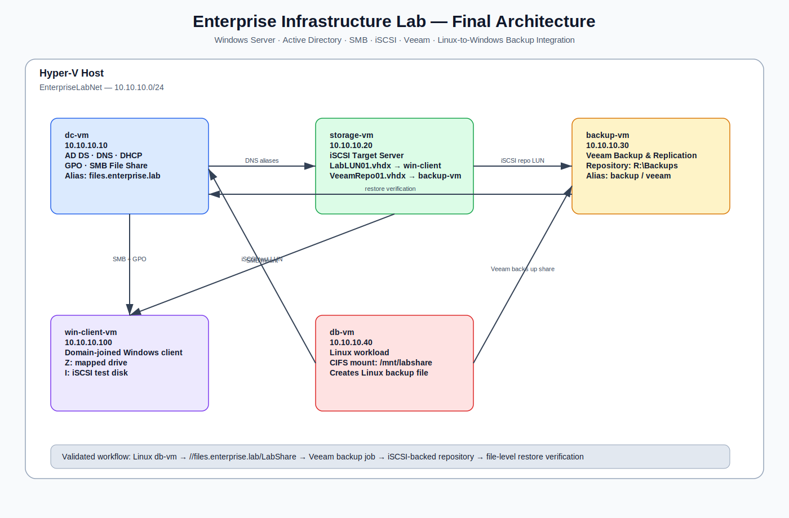
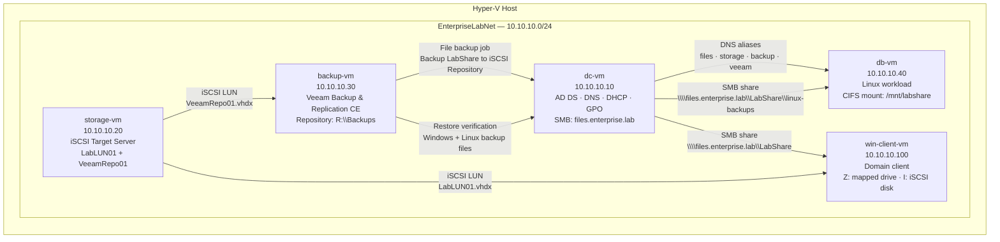

# Architecture Overview

## Final Architecture Diagram



Mermaid source:



---

## Network

```text
EnterpriseLabNet: 10.10.10.0/24
```

| VM | IP Address | Role |
|---|---:|---|
| `dc-vm` | `10.10.10.10` | AD DS, DNS, DHCP, GPO, SMB |
| `storage-vm` | `10.10.10.20` | iSCSI Target Server |
| `backup-vm` | `10.10.10.30` | Veeam Backup Server |
| `db-vm` | `10.10.10.40` | Linux workload integrated with SMB/Veeam workflow |
| `win-client-vm` | `10.10.10.100` | Domain client and iSCSI test client |

---

## Service DNS Aliases

| Alias | Target | Purpose |
|---|---|---|
| `files.enterprise.lab` | `dc-vm.enterprise.lab` | SMB file share service |
| `storage.enterprise.lab` | `storage-vm.enterprise.lab` | iSCSI storage service |
| `backup.enterprise.lab` | `backup-vm.enterprise.lab` | backup server |
| `veeam.enterprise.lab` | `backup-vm.enterprise.lab` | Veeam backup service |

---

## Backup Flow

```text
\\files.enterprise.lab\LabShare
        ↓
Veeam file backup job
        ↓
backup-vm
        ↓
R:\Backups
        ↓
iSCSI LUN from storage-vm
```

---

## Cross-Platform Backup Flow

```text
db-vm
10.10.10.40
        ↓
CIFS mount
//files.enterprise.lab/LabShare
        ↓
Windows SMB share
\\files.enterprise.lab\LabShare\linux-backups
        ↓
Veeam file backup job
        ↓
iSCSI-backed repository
R:\Backups
        ↓
Restore verification
```
