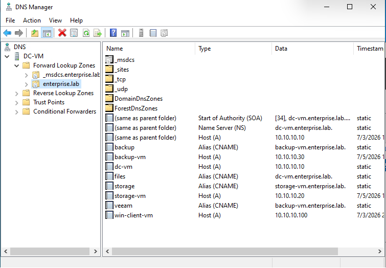
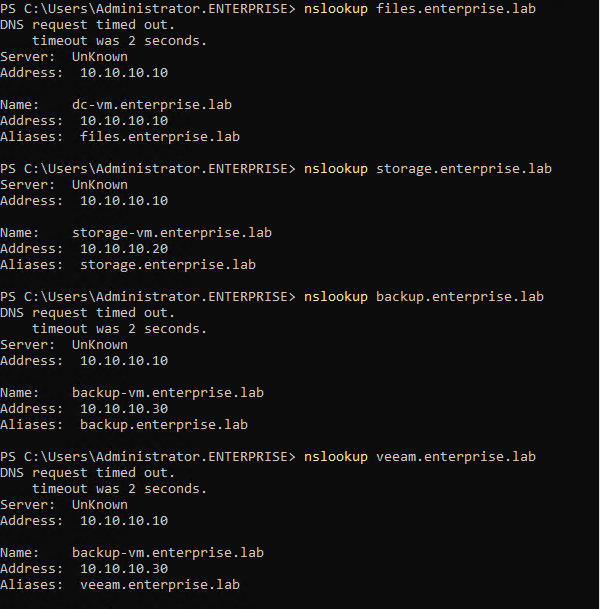
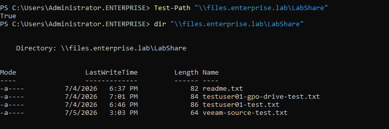
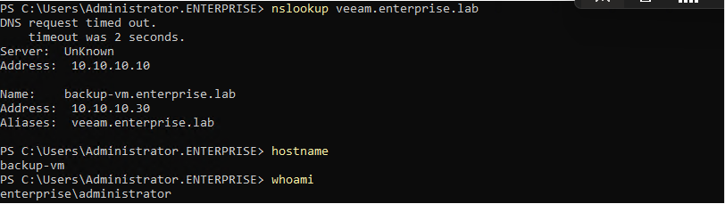

# 06 - DNS Aliases and Enterprise Naming

## Goal

Add service-oriented DNS aliases to make the lab easier to understand and closer to real enterprise naming practices.

Instead of accessing services only by VM hostnames, the lab now also uses DNS aliases such as:

```text
files.enterprise.lab
storage.enterprise.lab
backup.enterprise.lab
veeam.enterprise.lab
```

This makes documentation, troubleshooting and user-facing service paths cleaner.

---

## DNS Alias Design

| Alias | Type | Target | Purpose |
|---|---|---|---|
| `files.enterprise.lab` | CNAME | `dc-vm.enterprise.lab` | SMB file share access |
| `storage.enterprise.lab` | CNAME | `storage-vm.enterprise.lab` | iSCSI storage server alias |
| `backup.enterprise.lab` | CNAME | `backup-vm.enterprise.lab` | Backup server alias |
| `veeam.enterprise.lab` | CNAME | `backup-vm.enterprise.lab` | Veeam server alias |

---

## Implemented Records

The following CNAME records were created in the AD-integrated DNS zone:

```text
Zone: enterprise.lab

files    CNAME    dc-vm.enterprise.lab
storage  CNAME    storage-vm.enterprise.lab
backup   CNAME    backup-vm.enterprise.lab
veeam    CNAME    backup-vm.enterprise.lab
```

---

## PowerShell Commands

On `dc-vm`:

```powershell
Add-DnsServerResourceRecordCName `
  -ZoneName "enterprise.lab" `
  -Name "files" `
  -HostNameAlias "dc-vm.enterprise.lab"

Add-DnsServerResourceRecordCName `
  -ZoneName "enterprise.lab" `
  -Name "storage" `
  -HostNameAlias "storage-vm.enterprise.lab"

Add-DnsServerResourceRecordCName `
  -ZoneName "enterprise.lab" `
  -Name "backup" `
  -HostNameAlias "backup-vm.enterprise.lab"

Add-DnsServerResourceRecordCName `
  -ZoneName "enterprise.lab" `
  -Name "veeam" `
  -HostNameAlias "backup-vm.enterprise.lab"
```

---

## Verification Commands

From a domain-joined VM:

```powershell
nslookup files.enterprise.lab
nslookup storage.enterprise.lab
nslookup backup.enterprise.lab
nslookup veeam.enterprise.lab
```

Expected resolution:

```text
files.enterprise.lab     -> dc-vm.enterprise.lab      -> 10.10.10.10
storage.enterprise.lab   -> storage-vm.enterprise.lab -> 10.10.10.20
backup.enterprise.lab    -> backup-vm.enterprise.lab  -> 10.10.10.30
veeam.enterprise.lab     -> backup-vm.enterprise.lab  -> 10.10.10.30
```

SMB alias verification:

```powershell
Test-Path "\\files.enterprise.lab\LabShare"
dir "\\files.enterprise.lab\LabShare"
```

Expected result:

```text
True
The LabShare contents are listed successfully.
```

---

## Screenshots

### DNS CNAME Records



### DNS Alias Resolution



### File Share Access Through DNS Alias



### Veeam Alias Resolution Check



---

## Notes

The `nslookup` output may show a short DNS timeout before returning a valid response. In this lab, the important result is that the alias resolves to the expected canonical hostname and IP address.

The SMB share is now accessible through a cleaner service name:

```text
\\files.enterprise.lab\LabShare
```

This is preferable in documentation to using the physical server name directly:

```text
\\dc-vm\LabShare
```
