# 07 - Cross-Platform Linux-to-Windows Backup Integration

## Goal

This module connects the Linux/cloud part of the lab with the Windows infrastructure and Veeam backup workflow.

A Linux VM writes backup data to a Windows SMB share through the enterprise DNS alias `files.enterprise.lab`. The same SMB share is then protected by Veeam Backup & Replication, and the Linux-generated backup file is restored from Veeam.

---

## Architecture

```text
db-vm
Linux workload / backup file
10.10.10.40
        ↓
CIFS mount
//files.enterprise.lab/LabShare
        ↓
Windows SMB share
\\files.enterprise.lab\LabShare\linux-backups
        ↓
Veeam file backup job
backup-vm
        ↓
iSCSI-backed repository
R:\Backups
        ↓
File-level restore verification
```

---

## Components

| Component | Value |
|---|---|
| Linux VM | `db-vm` |
| Linux enterprise network IP | `10.10.10.40` |
| Windows DNS server | `10.10.10.10` |
| SMB DNS alias | `files.enterprise.lab` |
| SMB share | `\\files.enterprise.lab\LabShare` |
| Linux mount point | `/mnt/labshare` |
| Linux backup folder | `/mnt/labshare/linux-backups` |
| Windows backup folder | `\\files.enterprise.lab\LabShare\linux-backups` |
| Test file | `linux-backup-test.txt` |
| Veeam job | `Backup LabShare to iSCSI Repository` |
| Veeam repository | `R:\Backups` |

---


---

## AD Service Account and SMB Access

A dedicated AD service account was used for the Linux SMB mount:

```text
Service account: svc-linux-backup
Group: GG-Linux-Backup-Writers
Purpose: allow Linux db-vm to write backup files to the Windows SMB share
```

SMB access was validated from Linux by checking TCP port `445` against the DNS alias:

```bash
nc -zv files.enterprise.lab 445
```

Expected result:

```text
Connection to files.enterprise.lab 445 port [tcp/microsoft-ds] succeeded
```


## Network Integration

The Linux `db-vm` was connected to the Windows enterprise network using a second Hyper-V network adapter.

```text
eth0: 192.168.0.112/24
eth1: 10.10.10.40/24
```

The VM can resolve Windows service aliases through the Windows DNS server:

```text
files.enterprise.lab    -> dc-vm.enterprise.lab      -> 10.10.10.10
storage.enterprise.lab  -> storage-vm.enterprise.lab -> 10.10.10.20
backup.enterprise.lab   -> backup-vm.enterprise.lab  -> 10.10.10.30
veeam.enterprise.lab    -> backup-vm.enterprise.lab  -> 10.10.10.30
```

---

## SMB Mount

The Windows SMB share was mounted on Linux using CIFS:

```bash
sudo mount -t cifs //files.enterprise.lab/LabShare /mnt/labshare \
  -o username=svc-linux-backup,domain=ENTERPRISE,vers=3.0,sec=ntlmssp
```

Verification:

```bash
mount | grep labshare
ls -la /mnt/labshare
```

---

## Linux Backup File Creation

A Linux-generated backup file was created inside the mounted Windows SMB share:

```bash
echo "Linux backup test from db-vm at $(date)" | \
  sudo tee /mnt/labshare/linux-backups/linux-backup-test.txt
```

Linux verification:

```bash
ls -la /mnt/labshare/linux-backups
cat /mnt/labshare/linux-backups/linux-backup-test.txt
```

Windows verification:

```powershell
dir "\\files.enterprise.lab\LabShare\linux-backups"
type "\\files.enterprise.lab\LabShare\linux-backups\linux-backup-test.txt"
```

---

## Veeam Backup and Restore Verification

After the Linux file was created, the existing Veeam file backup job was started again and completed successfully.

```text
Job: Backup LabShare to iSCSI Repository
Source: \\files.enterprise.lab\LabShare
Repository: R:\Backups
Result: Success
```

The Linux-generated file was then deleted from the SMB share and restored from the Veeam backup.

```powershell
Remove-Item "\\files.enterprise.lab\LabShare\linux-backups\linux-backup-test.txt"
```

Post-restore verification:

```powershell
dir "\\files.enterprise.lab\LabShare\linux-backups"
type "\\files.enterprise.lab\LabShare\linux-backups\linux-backup-test.txt"
```

---

## Screenshots

### db-vm Second Network Adapter

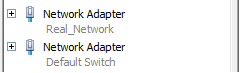

### Linux Enterprise Network Configuration

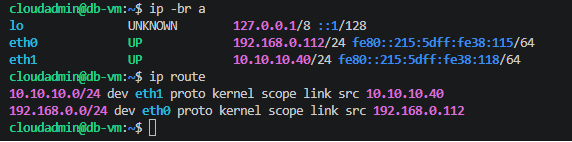

### Linux DNS Resolution

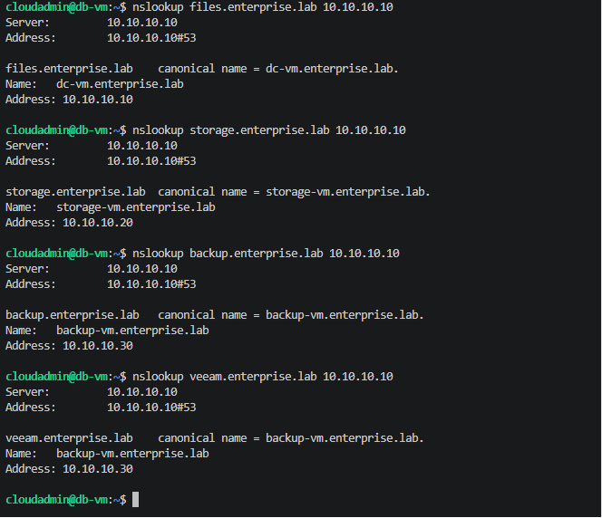

### Linux Connectivity to Windows Services

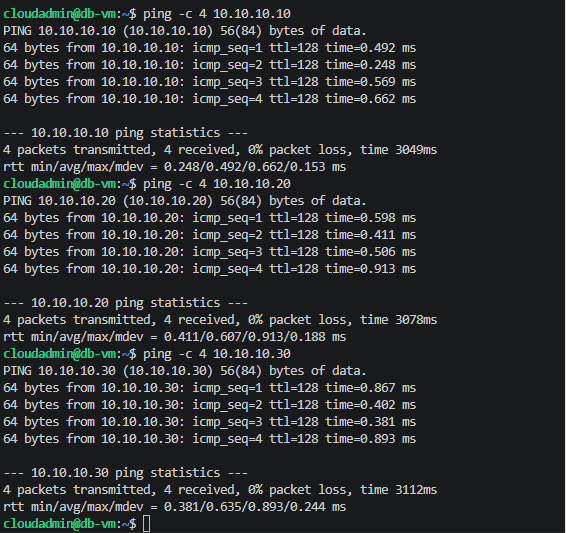


### AD Linux Backup Service Account

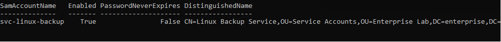

### Linux SMB Port 445 Check

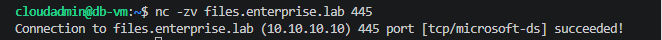

### Linux SMB Share Mounted

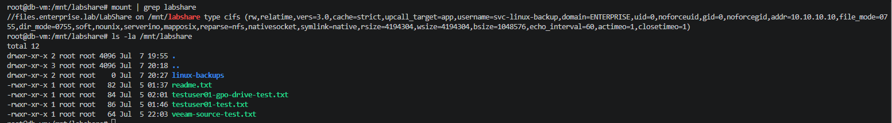

### Linux Backup File Created

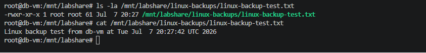

### Windows Sees Linux Backup File

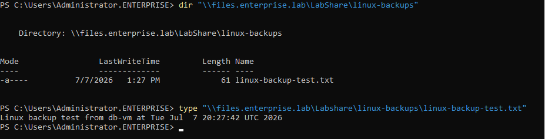

### Veeam Backup Job with Linux File


### Linux Backup File Deleted Before Restore

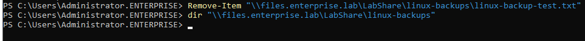

### Veeam Restore Browser with Linux Backup File

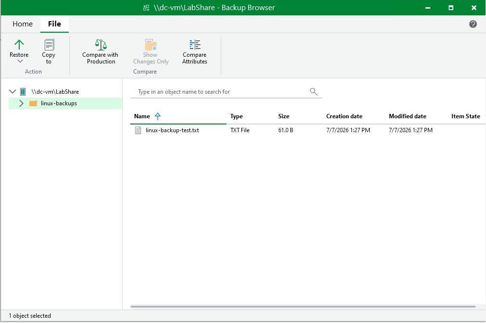

### Linux Backup File Restore Verified


---

## Result

The cross-platform backup workflow was completed successfully:

```text
Linux db-vm
→ Windows SMB share through files.enterprise.lab
→ Linux backup file created
→ File visible from Windows
→ Veeam backup job completed successfully
→ File deleted
→ File restored from Veeam
→ Restore verified from Windows
```
