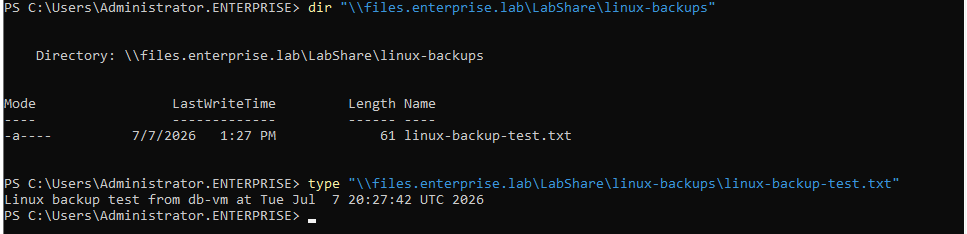

# 07 - Cross-Platform Linux-to-Windows Backup Integration

## Goal

This module connects the Linux/cloud part of the lab with the Windows infrastructure and Veeam backup workflow.

A Linux VM writes backup data to a Windows SMB share through the enterprise DNS alias `files.enterprise.lab`. The same SMB share is then protected by Veeam Backup & Replication, and the Linux-generated backup file is restored from Veeam.

---

## Architecture

```text
db-vm
Linux workload / backup file
10.10.10.40
        ↓
CIFS mount
//files.enterprise.lab/LabShare
        ↓
Windows SMB share
\\files.enterprise.lab\LabShare\linux-backups
        ↓
Veeam file backup job
backup-vm
        ↓
iSCSI-backed repository
R:\Backups
        ↓
File-level restore verification
```

---

## Screenshots




---

## Result

The cross-platform backup workflow was completed successfully:

```text
Linux db-vm
→ Windows SMB share through files.enterprise.lab
→ Linux backup file created
→ File visible from Windows
→ Veeam backup job completed successfully
→ File deleted
→ File restored from Veeam
→ Restore verified from Windows
```
