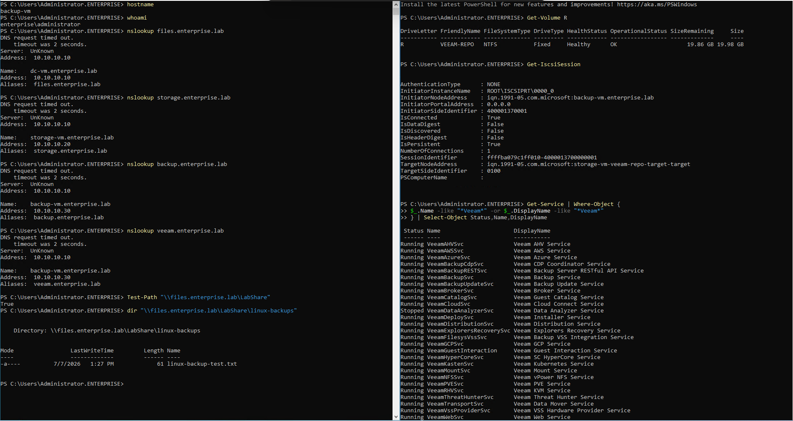

# 08 - Final Validation and Architecture

## Goal

Provide a final validation point proving that the Windows, storage, backup and Linux integration parts of the lab work together.

---

## Final Health Check

The final validation was executed on `backup-vm`.

It verifies:

- current hostname and domain user
- DNS aliases
- SMB share access through `files.enterprise.lab`
- Linux backup file visibility from Windows
- Veeam repository volume `R:`
- active iSCSI session
- running Veeam services

## Validation Commands

```powershell
hostname
whoami

nslookup files.enterprise.lab
nslookup storage.enterprise.lab
nslookup backup.enterprise.lab
nslookup veeam.enterprise.lab

Test-Path "\\files.enterprise.lab\LabShare"
dir "\\files.enterprise.lab\LabShare\linux-backups"

Get-Volume R
Get-IscsiSession

Get-Service | Where-Object {
    $_.Name -like "*Veeam*" -or $_.DisplayName -like "*Veeam*"
} | Select-Object Status,Name,DisplayName
```

---

## Expected Result

```text
backup-vm is the active backup server
enterprise\administrator is logged in
DNS aliases resolve correctly
\\files.enterprise.lab\LabShare is accessible
linux-backup-test.txt is visible in the SMB share
R: VEEAM-REPO is healthy
iSCSI session is connected and persistent
Veeam services are running
```

---

## Screenshot



---

## Architecture Diagram


---

## Result

The final health check confirms that the lab is functioning as a connected infrastructure system:

```text
AD DNS
+ SMB share
+ iSCSI repository
+ Veeam backup services
+ Linux-generated backup file
+ restore-capable backup workflow
```
